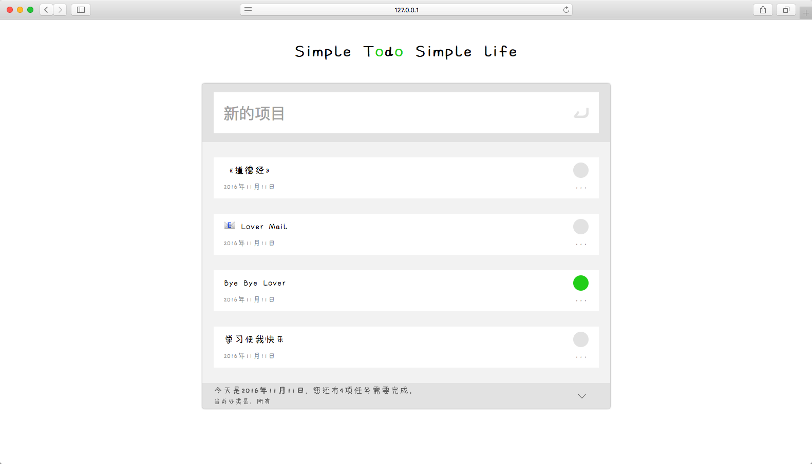

# Simple Todo Simple Life

typescript + svelte + async/await + sass 



#### run app

```
npm i
npm run build
npm start
```

### if you get this error : Cannot set property ’_timeout’ of undefined(…) 


look this
https://forum.leancloud.cn/t/js-sdk-error-cannot-set-property--timeout-of-undefined/12427